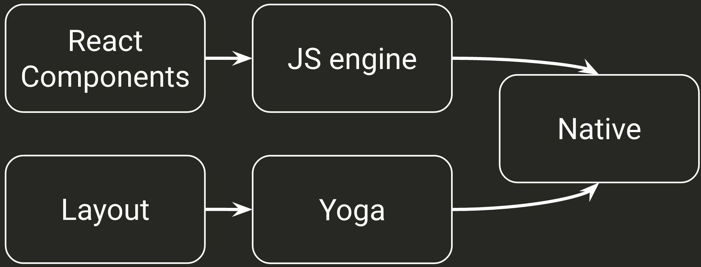
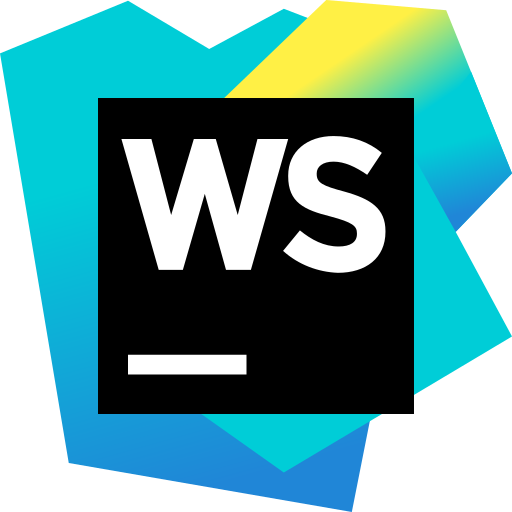
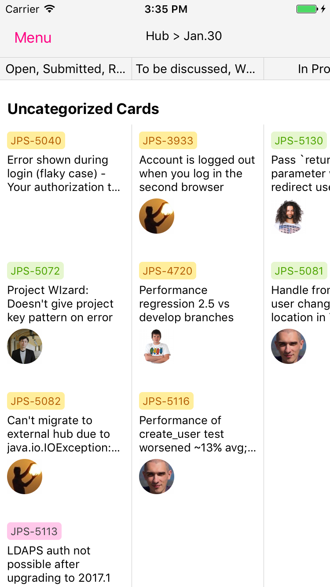

layout: true
class: inverse

---
class: center, middle

# В релиз с React Native

.footnote[Складчиков Андрей, JetBrains]

---
# Тактика

- Немного воды про React Native
- Как я делал YouTrack Mobile
- Что у меня из этого вышло
- Кроссплатформенность
- Вывод

---
# Что такое React Native?

Фреймворк для создания нативных приложений с использованием технологического стэка React-а:
- JavaScript
- React
- JSX
- Virtual DOM
- Flux

???
* JavaScript - в широком смысле этого слова, т.е. большой объём OpenSource.
* React и компания, это 
* JSX - удобный и популярный способ разметки, альтернатива разнообразным способам создавать UI в нативной разработке.
* Virtual DOM -  уже доказал свою состоятельность, позволяет обновлять стейт не задумываясь над оптимизацией ререндера
* Flux - популярно в последнее время, и это самый простой способ использовать этот набор паттернов в нативной разработке.
---

.wide-image[]

???
Как видно, за последние пару лет популярность React Native растёт на фоне стагнации традиционных методов разработке
---
# Как это работает?

.wide-image[]
???
* Разработчиком описывается дерево компонентов, отображающее соответствующий стейт.
* Это исполняется на JS-движке, это JavaScriptCore на обоих платформах (на нём работает мобильный Safari)
* Разметка, описанная в CSS-IN-JS, обрабатывается движком Yoga
* Всё это применяется к нативным UI-компонентам, обеспечивая т.н. native look and feel
---

# Почему React Native?
- React и инфраструктура
--

- Скорость и стоимость разработки
--

- Там есть Live Reload, Hot Update и куча модных слов.
--

- Мультиплатформенность
--

- Любой текстовый редактор
.appear-dissapear-image[]
--

- Сообщество

---
# YouTrack Mobile

.wide-image.youtrack-mobile-image[]

???
* Вот такое приложение, это мобильный клиент к нашему баг-трекеру. 
Там есть список ишшуёв, просмотр, создание, редактирование – стандартный набор.
---
# Краткая история

- Проект хакатона 2015 года
- В январе 2016 года проект начал дорабатываться как 20%-й проект
- 8 ноября 2016 года проект вышел в публичный релиз
- Open Source, доступен на gihub ([JetBrains/youtrack-mobile](https://github.com/JetBrains/youtrack-mobile))

---
# Попробуйте сами!
### AppStore/Google Play: «YouTrack»
### ytm-test.myjetbrains.com
### PiterJS/PiterJS

---
background-image: url(images/spooky.jpg)

--
.tall-image[]

???
* Вот такой прототип мобильной Agile-доски удалось сделать за 5-6 часов.
Это показывает скоростть разработки – я уверен, что на iOS это заняло бы больше времени.
---

.wide-image.shift-image[]

???
* Много времени занимает обновление реакта. Они очень любят нестись вперёд, ломают обратную совместимость. 
Для обновления есть специальная команда, которая заменяет бойлерплейт на тот, который соответствует последней версии.
Но это очень тяжело для автогенерируемых XCode файлов, таких как этот.
---
.left-column[
  .tall-image[]  
]

.right-column[
  ### Upgrade
]

???
Часто при апгрейде сборка просто ломается, и приходится погружаться в дебри нативной разработки.
Да, мне пришлось разобраться, что такое Gradle и XCode build, как настраивать сборку и т.д.
---
# Тестирование

- Всё то же самое
- Mocha, chai, sinon
- Enzyme для shallow-render
- e2e тестирование так же доступно

---
# Тестирование

```js 
it('should render strong text with stars syntax', () => {
    const wrapper = shallow(<Wiki>{`*foo text*`}</Wiki>);
    const boldNode = wrapper.find({testID: 'strong'});

    boldNode.prop('style').fontWeight.should.equal('bold');
});
```

```js
it('should connect to youtrack', () => {
    const connectButton = wrapper.find(TouchableOpacity);
    connectButton.simulate('press');

    connectToYouTrack.should.have.been.calledWith(serverUrl);
});
```

---
# Flux/Redux/Reflux/Mobx
--

### Нет.
--

### А надо бы.

---
# Flow

--

```js
type Props = {
  style?: any,
  query: string,
  caret: number,
  getSuggestions: (query: string, caret: number) => Promise<Array<ServersideSuggestion>>,
  onApplySuggestion: (newQuery: string) => any
};
```

---
## А можно под обе платформы?

--
### Learn once, write anywhere ©

--
- С YouTrack Mobile удалось сохранить единую кодовую базу
- Очень мало плафтмормозависимых мест в коде
- Очень много мелочей, которые работают по-разному
- В среднем, React Native на Android работает хуже и медленнее

---
## Платформозависимость

```js
  monospace: {
    fontSize: FONT_SIZE,
    ...Platform.select({
      ios: {
        fontFamily: 'Courier New'
      },
      android: {
        fontFamily: 'Droid Sans Mono'
      }
    })
  },
```

```js
{Platform.OS == 'ios' && <KeyboardSpacer/>}
```

```js
if (Platform.OS === 'ios') {
    Router.AttachmentPreview({url, name});
} else {
    Linking.openURL(url);
}
```

---
# У всего есть своя цена

- UI не всегда соотвутствует принятому в платформе
- Отсутствует Material Design
- Всё приходится проверять дважды

---
# Вывод

- React Native - это весело

--
- React в президенты

--
- С ним можно работать и создавать приложения production-уровня

--
- Все проблемы преодолимы

???
* React Native - это всё ещё передный край разработки, тут происходит много движения.
* React - это локомотив современной разработки, он адресует большинство потребностей и делает это в меру элегантно.
---

# Cтоит ли рассматривать React Native?

- Простое приложение без сложной логики и UI
- Возможностей WEB уже не хватает, но нативное API необходимо по-минимуму
- Есть **приличный** опыт JS/React/etc
- Опыт нативной разработки приветствуется

---
class: center, middle
# The End

.left-column[

]

.right-column[
Складчиков Андрей

@huston007

github.com/huston007

andrey.skladchikov@gmail.com
]