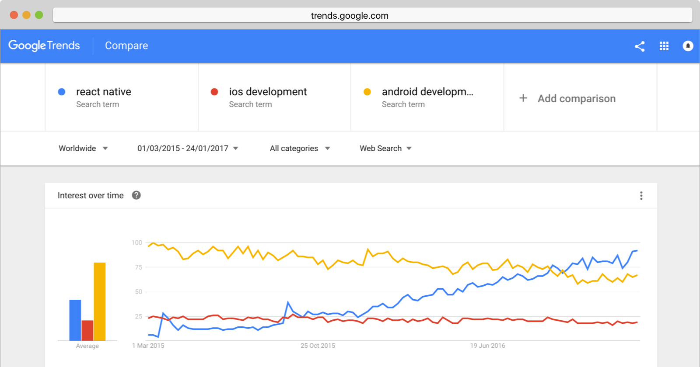

layout: true
class: inverse

---
class: center, middle

# В релиз с React Native

.footnote[Складчиков Андрей, JetBrains]

---
# Тактика

- Немного воды про React Native
- Как я делал YouTrack Mobile
- Что у меня из этого вышло
- Кроссплатформенность
- Вывод

---
# Что такое React Native?

Фреймворк для создания нативных приложений с использованием технологического стэка React-а:
- JavaScript
- React
- JSX
- Virtual DOM
- Flux

---

.wide-image[]

---
# Как это работает?

.wide-image[]

---

# Почему React Native?
- React и инфраструктура
--

- Скорость и стоимость разработки
--

- Там есть Live Reload, Hot Update и куча модных слов.
--

- Мультиплатформенность
--

- Любой текстовый редактор
--

- Сообщество

---
# YouTrack Mobile

.wide-image[]

---
# Краткая история

- Проект хакатона 2015 года
- В январе 2016 года проект начал дорабатываться как 20%-й проект
- 8 ноября 2016 года проект вышел в публичный релиз
- Open Source, доступен на gihub ([JetBrains/youtrack-mobile](https://github.com/JetBrains/youtrack-mobile))

---
# Попробуйте сами!
### AppStore/Google Play: «YouTrack»
### ytm-test.myjetbrains.com
### PiterJS/PiterJS

---
background-image: url(images/spooky.jpg)

---

.wide-image[]

---
.left-column[
  .tall-image[]  
]

.right-column[
  ### Upgrade
]

---
# Тестирование

- Всё то же самое
- Mocha, chai, sinon
- Enzyme для shallow-render
- e2e тестирование так же доступно

---
# Тестирование

```js 
it('should render strong text with stars syntax', () => {
    const wrapper = shallow(<Wiki>{`*foo text*`}</Wiki>);
    const boldNode = wrapper.find({testID: 'strong'});

    boldNode.prop('style').fontWeight.should.equal('bold');
});
```

```js
it('should connect to youtrack', () => {
    const connectButton = wrapper.find(TouchableOpacity);
    connectButton.simulate('press');

    connectToYouTrack.should.have.been.calledWith(serverUrl);
});
```

---
## А можно под обе платформы?

--
### Learn once, write anywhere ©

--
- С YouTrack Mobile удалось сохранить единую кодовую базу
- Очень мало плафтмормозависимых мест в коде
- Очень много мелочей, которые работают по-разному
- В среднем, React Native на Android работает хуже и медленнее

---
## Платформозависимость

```js
  monospace: {
    fontSize: FONT_SIZE,
    ...Platform.select({
      ios: {
        fontFamily: 'Courier New'
      },
      android: {
        fontFamily: 'Droid Sans Mono'
      }
    })
  },
```

```js
{Platform.OS == 'ios' && <KeyboardSpacer/>}
```

```js
if (Platform.OS === 'ios') {
    Router.AttachmentPreview({url, name});
} else {
    Linking.openURL(url);
}
```

---
# У всего есть своя цена

- UI не всегда соотвутствует принятому в платформе
- Отсутствует Material Design
- Всё приходится проверять дважды

---
# Вывод

- React Native - это весело
- React в президенты
- С ним можно работать и создавать приложения production-уровня
- Все проблемы преодолимы

---

# Cтоит ли рассматривать React Native?

- Простое приложение без сложной логики и UI
- Возможностей WEB уже не хватает, но нативное API необходимо по-минимуму
- Есть **приличный** опыт JS/React/etc

---
class: center, middle
# The End

.left-column[

]

.right-column[
Складчиков Андрей

@huston007

github.com/huston007

andrey.skladchikov@gmail.com
]